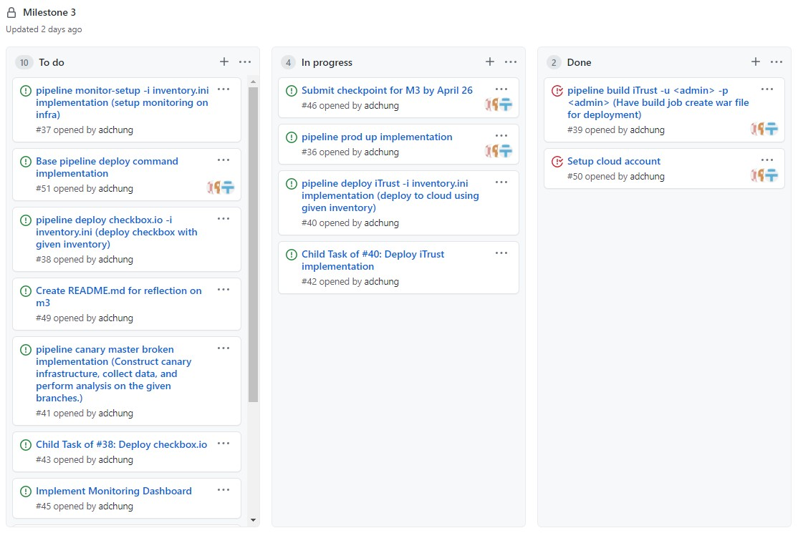
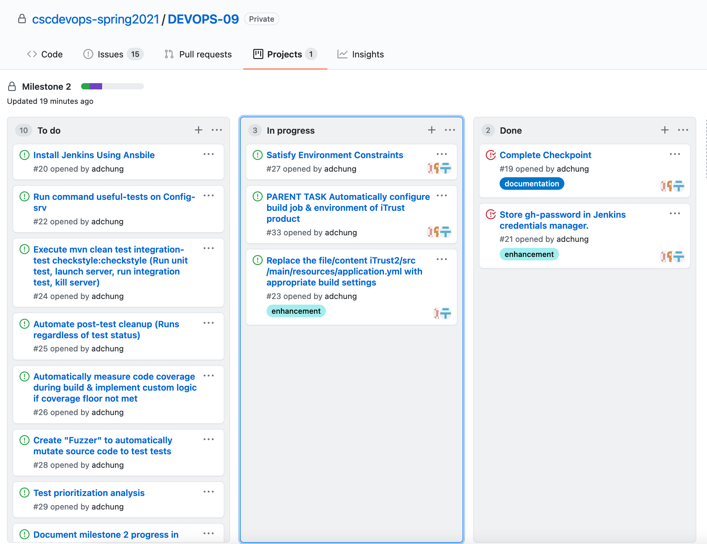
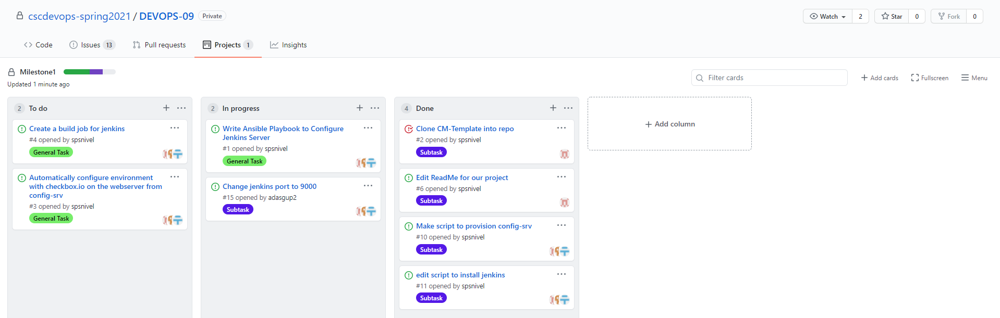

## Checkpoint April 26, 2021

### Work Completed so far:
- Updated `setup.js` to fix issues from last milestone.
- Created `prod up` command to create three VM's (iTrust, Checkbox, and Monitor) on Google Cloud.
- Created `inventory.ini` file based on the VM's IPs and the required ssh keys. This is generated programmatically depending on what user is running the command.
- Started working on `deploy iTrust` command. Right now we are able to run this command which runs an ansible playbook in config-srv. The ansible playbook runs a set of tasks within the google cloud iTrust vm, which shows that our inventory.ini file was generated correctly.

### Work Breakdown
Arno, Sean, and Alex pair programmed over meetings and screenshares to get to the current development status. We plan on splitting tasks up to allow for more asynchronus work, and having small check-ins throughout the week.

## Checkpoint March 29, 2021

### Work Completed so far:
- Updated `setup.js` to take in github credentials.
- Added functionality to add jenkins credentials to jenkins credential manager through REST API call.
- Updated `build.js` to use the name parameter and pass that to the `trigger-build.js` function.
- Created build job to use GitHub credentials to clone repo. 

### Work Breakdown
Arno, Sean, and Alex pair programmed over meetings and screenshares to get to the current development status. We plan on meeting daily until the project is complete. Our next steps are to set up the iTrust2 environment and then go into the `usefultests.js` section.

## Checkpoint March 9, 2021

### Work Completed so far:
- Setup the configuration management template
- Setup our CLI NodeJS Program to accept `pipeline setup` (completed) `pipeline build` (not yet implemented)
- Implemented auto provisioning of the `config-srv` server using focal image (Set static IP 192.168.33.29 & gave it 4GB of RAM) & setup auto installation of ansible on it.
- Installed ansible on `config-srv` using a shell script executed on the server during the pipeline setup
- Installed jenkins and set to autorun on `config-srv` but it's on 8080 instead :9000.

### Work Breakdown
Arno, Sean, & Alex pair programmed over meetings & screenshares to get to the current status. We plan on meeting daily until the project is completed. Our next steps are to finish the setup of `config-srv` and from there we will pivot to provisioning + configuring up the web server from our config server.

Current progress in our GitHub Projects:

